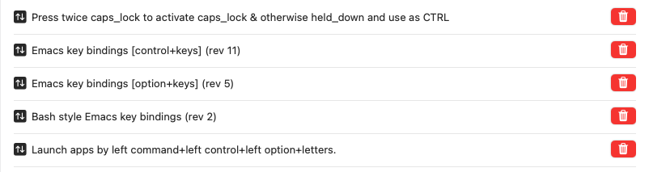

# My Karabiner-Elements config
- emacs keybindings
    - caps → control (press and hold = **C-**)
    - C-e: end of line
    - C-a: beginning of line
    - C-d: delete next char
    - backspace or C-h for deleting the previous char
    - C-b: move back one char
    - C-f: move forward one char
    - C-n: down (next)
    - C-p: up (previous)
    - C-m: return
    - C-k: delete a whole line
    - C-v: pagedown
    - Option-v: pageup
    - C-w: delete by word
- Left control+option+command (see custom script `zyc_app.json`)
    - w: WeChat
    - m: Mail
    - s: Safari
    - k: Slack
    - l: Calendar
    - c: VS Code
    - t: Terminal
    - n: Notion

To import a customized script after modifying the json file, go to this [K-E](https://ke-complex-modifications.pqrs.org) page, find a similar script, hit `Edit JSON (Open external site)` and paste the content in the bottom right textbox for further import into K-E.

# Complex Modifications (a screenshot)

# Helpful refs
How to sync profiles across devices: https://karabiner-elements.pqrs.org/docs/manual/operation/export/
